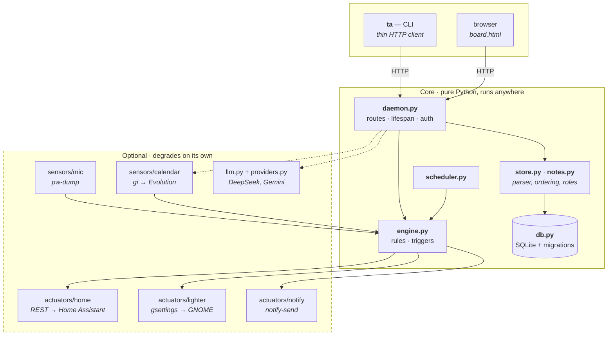
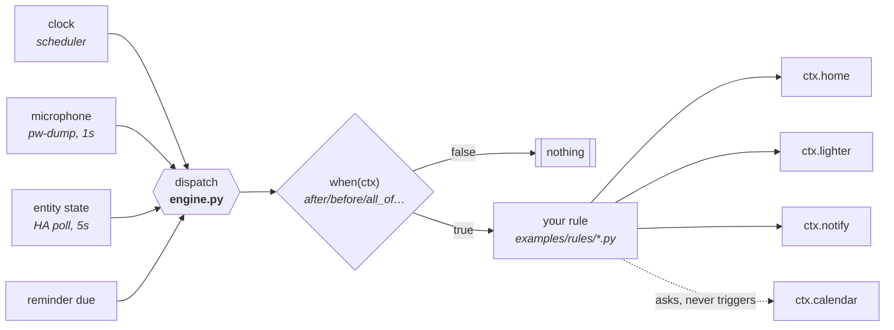
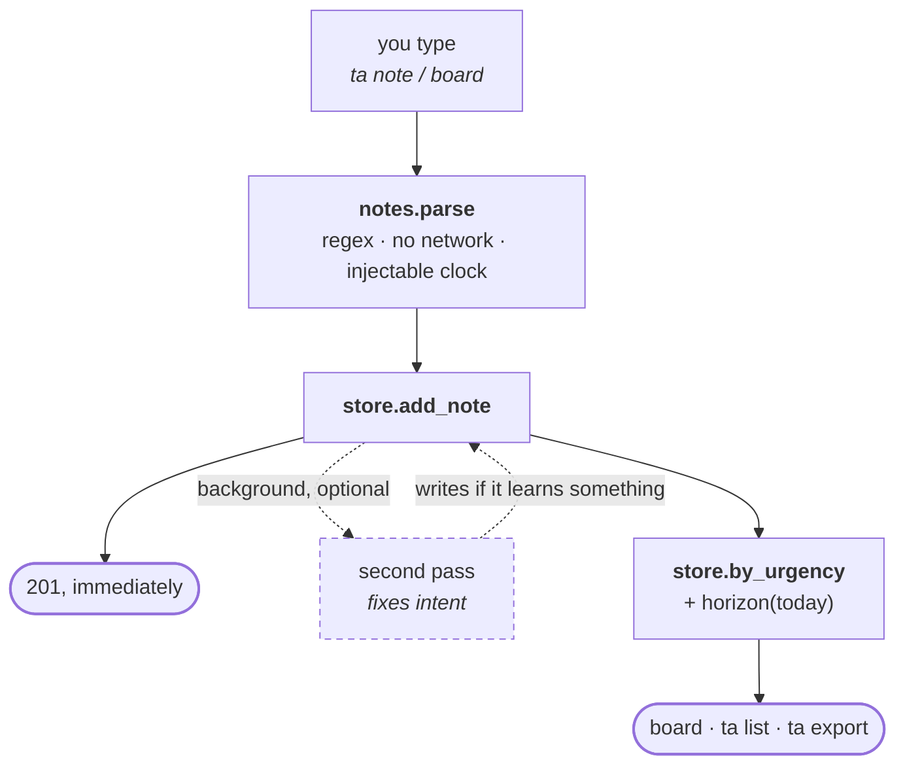

# Contributing

Thanks for looking. This is a personal project that was opened up because the
ideas in it might be useful to someone else — it is not a product with a
roadmap, and there is no obligation on either side.

Before anything else: **this page is for people changing the code.** If you are
trying to *use* the thing, you want [`docs/install.md`](docs/install.md).

## How it fits together

Three diagrams, because three questions come up every time.

### What is actually required?

The dashed box is optional. Every integration in it checks whether its tool
exists and goes inert with a log line if it does not — the whole test suite
passes with `gi` blocked and nothing else installed, and CI proves it on a bare
`ubuntu-latest`.



**Nothing in `core` imports anything from `opt`.** That is the whole positioning
of the project, and it is checked by tests rather than promised in prose.

### How does an automation fire?

A **Rule** is a trigger, optional conditions, and actions. Note where the
calendar sits: it is **context, not a trigger**
([ADR 0008](docs/adr/0008-the-microphone-is-the-meeting-trigger.md)). The microphone
says *you are in a call*; the calendar says *which call*, and only if something
asks.



A rule that raises does not take the others down, and a rule file that fails to
import does not stop the daemon — `ta rules check` validates without booting
anything.

### What happens to a note between typing it and seeing it?

This one diagram explains the two principles people trip on: the model is never
on the critical path ([ADR 0003](docs/adr/0003-the-llm-is-never-on-the-critical-path.md)),
and the time band is computed from the clock at display time, never stored
([ADR 0010](docs/adr/0010-the-clock-orders-the-board.md)).



The dashed branch is the only place a model runs by itself, and it runs **after**
the response. Without an API key the solid path is unchanged.

## Getting set up

```bash
git clone <your fork>
cd terminal-assistant
make install        # venv on the system Python + the package, editable
ta doctor           # what works on your machine, and how to fix the rest
make test
make lint
```

`ta doctor` is the fastest way to understand your own environment. Missing
integrations are normal — only the notes core is essential, and the command exits
non-zero only if *that* is broken.

If you are touching the calendar, you also need
`sudo apt install gir1.2-ecal-2.0 gir1.2-edataserver-1.2` and a venv created with
`--system-site-packages`. `make check-gi` tells you whether it worked.

## Language

The **documentation** is English. There is a short Portuguese summary
([`README.pt-BR.md`](README.pt-BR.md)) that is deliberately *not* a translation —
it is small enough to never rot.

The **code is English too** — comments, docstrings and identifiers. It was written
in Portuguese and translated in one pass when the project opened up; if `git blame`
points you at that commit, the line before it is in
[`.git-blame-ignore-revs`](.git-blame-ignore-revs), and the next section tells your
`git` to skip it.

But not everything in the code *should* be English, and the line between the two
is not a matter of taste. It is one question: **does a person or a database ever
see this string?**

| What | Language | Why |
|---|---|---|
| Identifiers, comments, docstrings | English | Nobody outside the repo reads them |
| Catalogue keys (`board.title`), `HORIZONS` values (`overdue`) | English | Derived at display time; never stored, never typed |
| Stored tags (`trabalho`, `anotacao`), group names (`luz`, `tudo`), priority input (`!alta`), date marks (`@sexta`) | **Portuguese, forever** | Somebody's database holds them and somebody's fingers type them |
| `ctx.calendar.agora()` / `.hoje()` | **Portuguese, forever** | Rules live in `~/.config/ta/rules/`, outside this repo, where no rename of ours can reach |
| Anything a person reads | Neither — it goes in the catalogue | `src/ta/i18n.py`, both languages side by side |

That last row is the one that gets forgotten. A user-visible string written
directly in English is not "translated", it is **untranslatable** — and it will
read as broken to the half of users on the other language. The catalogue keeps both
versions on the same line precisely so the gap is visible while you write it.

Two known gaps, stated rather than hidden: the LLM prompts in `src/ta/llm.py` and
the Priorities template in `src/ta/priorities.py` are still Portuguese. The prompts
because they are one carefully tuned artefact and retuning them is its own change;
the template because its headings end up *inside* the document that gets stored, so
translating it would split the corpus in two.

**The database is English.** `Note`, `horizon`, `sort_key`, `status`, `priority` —
including the values (`high`, `todo`). Input still accepts both (`!alta` and
`!high` both work, forever), because the language of what you type is not the
language of what gets stored
([ADR 0006](docs/adr/0006-one-note-entity-with-roles.md#emenda-2026-08-11)).

### Making `git blame` skip the translation

One command, once per clone:

```bash
git config blame.ignoreRevsFile .git-blame-ignore-revs
```

Without it, `git blame` on any file credits the translation commit for nearly every
line, and the history stops being readable — which is the actual cost of a
mechanical rename, and the reason this file exists.

## The comments are the point

This codebase comments *why*, not *what*. A comment that restates the line above
it is noise; a comment that records the failure that led to the line is the most
valuable thing in the file. Look at almost any function for the house style.

If you fix something subtle, the fix and the story of the bug belong together.
Someone — probably you, in four months — will want to "simplify" it.

## Opening a pull request

One PR, one thing. A branch name that says what it does.

### The subject line, for both commits and PR titles

The first line is `type(scope): subject`. The prefix is not bureaucracy: it is the
one word that tells a reader whether to keep reading, and it makes
`git log --oneline | grep fix` a reliable question rather than a guess.

```
fix(board): o checkbox de concluídas voltou a aparecer em todas as visões
feat(cli): ta doctor lista as seis capacidades com motivo e conserto
refactor(daemon): renomeia os identificadores para inglês
adr: a hora decide o fim da reunião, não a entrada
fix(i18n)!: HORIZONS passa a gravar valores em inglês
```

**The type**, one of:

| | |
|---|---|
| `feat` | new behaviour somebody can use |
| `fix` | a defect — say the **symptom** in the body, not just the file |
| `docs` | documentation only |
| `test` | tests only, no behaviour change |
| `refactor` | same behaviour, different shape — a rename lives here |
| `perf` | measurably faster or lighter, **with the measurement** in the body |
| `build` | packaging, dependencies, the Makefile |
| `ci` | the workflows, and the guards that run in them |
| `chore` | the leftovers. Use it when nothing else fits, not as a default |
| `adr` | an architecture decision record |

`adr` is not in the Conventional Commits list and is here because this project
treats a decision record as a deliverable: an ADR is neither `docs` (it is not
describing the code, it is deciding) nor `feat` (nothing shipped).

**The scope** is optional, and when present comes from this list so that grepping
it is reliable: `notes`, `board`, `cli`, `daemon`, `db`, `store`, `home`,
`calendar`, `mic`, `lighter`, `ai`, `i18n`, `docs`, `ci`, `security`, `rules`.
If none fits, leave it out rather than inventing one.

**`!` before the colon** means a user has to do something — rotate a token, edit
their `config.toml`, accept that a stored value changed shape.

**The subject** continues the line that `type: ` started, so it does not begin with
a capital and does not end in a full stop. Write it in either language; write it so
that somebody scanning a hundred lines finds theirs.

### The body: problem → decision → what you found on the way

The subject line says *what*. The body is where this repository earns its `git log`,
and it is the main reason the project is understandable at all:

```
fix(board): o checkbox de concluídas voltou a aparecer em todas as visões

What was wrong, and how it showed up. The symptom matters more than the
code — "the board drew the wrong order with the right look" says more than
"fixed sorting".

What was decided, and why that over the alternative you rejected.

Achado no caminho / Found on the way: the thing the plan did not predict.
This section is where half the value lives.
```

### What is checked, and what is not

**PR titles are validated in CI.** **Commit subjects are not.**

That asymmetry is deliberate. A commit is a private draft until it is pushed, and a
hook that rejects `wip` while you are still thinking costs more than it buys — you
can always reword before opening. A PR title is different: it survives the squash
into `git log`, into the release notes, and into the list somebody scans looking for
the change that broke their machine. That one is worth a gate.

Check yours before opening, and get the same answer CI will:

```bash
python scripts/pr_title.py "fix(board): o checkbox de concluídas voltou a aparecer"
```

### Checklist

- `make lint` and `make test` are green.
- Documentation went to **its owner**, not to whichever file you had open — see
  the table in the [README](README.md#documentation). Every fact has exactly one
  home; everything else links to it.
- **If you changed the UI, look at the screen.** "Returns 200 and contains the
  string" is not interface verification. Five separate bugs in this project's
  history were visible only in a screenshot: a clipped counter, an invisible
  swatch, a warning hidden behind a post-it, dark-on-dark text, and a delete
  button that had escaped its card.
- An ADR if the decision qualifies — see below.

Typo and broken-link fixes do not need a PR ceremony. Just send them.

## When to write an ADR

`docs/adr/` records **why** the hard decisions were made, including the options
that were rejected — which is what stops someone from "fixing" them later.

Write one only when all three are true:

1. **Hard to reverse.** Changing your mind later has real cost.
2. **Surprising without context.** A future reader will ask "why on earth?"
3. **A genuine trade-off.** There were real alternatives and you picked one.

If any is missing, skip it — a comment in the code is the right size. Amend an
existing ADR rather than writing a contradicting one; there are several
amendments in there already, and they read better than a graveyard of superseded
files.

## Reporting a bug

Please include the output of **`ta doctor`**. It answers most of the first round
of questions on its own: which integrations are live, where the config lives, and
what language the parser is using.

Security issues go through GitHub's private vulnerability reporting instead —
see [`SECURITY.md`](SECURITY.md).

## Licence

By contributing you agree your contribution is licensed under Apache-2.0, the
project's licence. That is [section 5][apache5] of the licence itself, which is
why there is no CLA to sign.

[apache5]: https://www.apache.org/licenses/LICENSE-2.0#contributions
