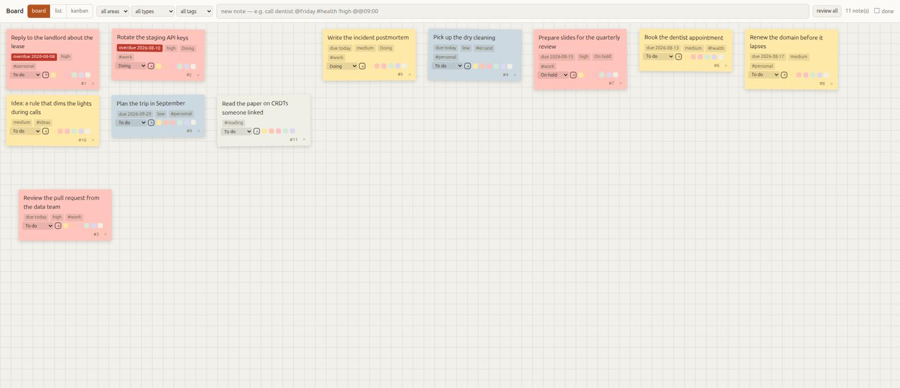
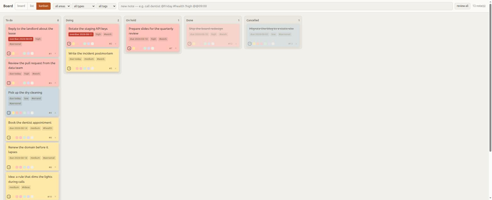

# Terminal Assistant

[](https://github.com/joaoferrete/terminal-assistant/actions/workflows/ci.yml)
[](LICENSE)

A trigger engine for your tasks and your house, in one command-line tool.

Capture a note in a second and never think about where it went. Let the clock
decide what you see first. And — if you want it — let *your machine's own state*
drive your lights, because Home Assistant does not know you just joined a call
and GNOME does not know how to turn on a lamp.

**The core runs anywhere Python runs.** Notes, the board, the trigger engine and
the scheduler need nothing but Python and a file to write to. Everything else —
Home Assistant, your calendar, the microphone sensor, the AI — is optional, and
each one checks whether it can work and goes quiet if it cannot.



## Try it in 60 seconds

No Home Assistant, no API key, no configuration:

```bash
git clone https://github.com/joaoferrete/terminal-assistant
cd terminal-assistant
make install

ta doctor                                   # what works on your machine
ta note "call the dentist @friday !high"    # capture
ta list                                     # overdue first, then today
ta board                                    # the board, in your browser
```

Want to poke at it with data already in it? `make demo` boots an isolated daemon
on port 7778 with a seeded database and never touches yours.

## What is optional

`ta doctor` answers this for *your* machine, with the fix for each line. In
general:

| Feature | Needs | Without it |
|---|---|---|
| **Notes, board, export** | nothing | — it always works |
| **Trigger engine, reminders** | nothing | — it always works |
| **Meeting detection** | PipeWire (`pw-dump`) | rules on the mic trigger stay inert |
| **Lights, plugs, sensors** | a Home Assistant + token | the `home` commands say so and exit |
| **Calendar, `ta today` events** | GNOME Online Accounts + Evolution | the digest still lists your tasks |
| **Ringlight** | the [Lighter][lighter] GNOME extension | that action does nothing |
| **Telegram bot** | a bot token + your username | you still capture from the terminal and the board |
| **AI features** | a DeepSeek or Gemini API key | capture, board and rules are untouched |

The AI is genuinely optional, not nominally: **no feature you rely on depends on
it**, nothing calls a model unless you ask, and opening the board never costs
money ([ADR 0003](docs/adr/0003-the-llm-is-never-on-the-critical-path.md)).

## What it looks like

Capture is one line, and the syntax is small enough to remember:

```bash
ta note "call the dentist @friday #health !high"
ta note "team sync tomorrow at 2pm"          # plain language works too
ta note "renew the domain @2026-09-01"
```

The board reorders itself by **when things are due**, not by the priority you
declared — a `!low` due today sits above a `!high` due next week, because the one
due today is the one due today.



And an automation is just Python:

```python
# ~/.config/ta/rules/meeting.py
@rule(on=mic_active())
async def meeting(ctx):
    event = await ctx.calendar.agora()          # the calendar says WHICH meeting
    if "1:1" in (event or {}).get("summary", ""):
        return                                  # a 1:1 needs no production
    await ctx.home.switch_on("light.bedroom", 100)
```

## Documentation

Every fact has exactly one home. Start wherever your question is.

| Start here | |
|---|---|
| [Install](docs/install.md) | Step by step, in layers. Take only the ones you want |
| [Configuration](docs/configuration.md) | Every environment variable and config key |
| [Troubleshooting](docs/troubleshooting.md) | Symptom → cause → fix |

| Per feature | |
|---|---|
| [Notes and the board](docs/notes.md) | Capture syntax, roles, ordering, the three views |
| [Home Assistant](docs/home-assistant.md) | From zero: token, entities, aliases, the traps |
| [Calendar](docs/calendar.md) | Online Accounts, typelibs, the dedicated calendar |
| [AI](docs/ai.md) | What it adds, what it costs, how to turn it off |
| [Automations](docs/automations.md) | The rule engine, every trigger, six recipes |
| [Shortcuts](docs/shortcuts.md) | Aliases and global keybindings |

| Why things are the way they are | |
|---|---|
| [`CONTEXT.md`](CONTEXT.md) | The glossary. Worth reading before naming anything |
| [`docs/adr/`](docs/adr/) | The hard decisions, including the rejected options |
| [`CONTRIBUTING.md`](CONTRIBUTING.md) | Architecture diagrams, and how to send a change |
| [`AGENTS.md`](AGENTS.md) | The same, condensed for coding agents — what they get wrong here |
| [`SECURITY.md`](SECURITY.md) | What it exposes, and what it deliberately does not |

Não fala inglês? Há um [resumo em português](README.pt-BR.md).

## Requirements, honestly

Python **3.12 or newer**, and a place to write a SQLite file. That is the whole
requirement for the core.

The optional integrations are Linux-desktop shaped: they were built on Ubuntu
with GNOME, Wayland and PipeWire, and that is where they are exercised. The
calendar in particular reads Evolution Data Server through PyGObject, so it wants
the system Python — see [ADR 0005](docs/adr/0005-the-system-python-because-of-pygobject.md),
because a `python3 -m venv` typed from reflex produces an environment where
`import gi` fails with no obvious explanation.

It runs on one machine — your laptop — by default. It can also run on an always-on
home server, where the core and Home Assistant keep working with the laptop
closed, at the cost of the desktop-shaped integrations; see
[Install → on a home server](docs/install.md#alternative-on-a-home-server).
Bringing those back from the laptop, and adding other computers as clients, is
the work in progress described in [the V2 plan](docs/PLAN.md).

macOS and Windows are not supported. The core would probably run; nothing else
would, and nobody has tried.

## A note on privacy and network

The daemon listens on **`127.0.0.1` only**, and it refuses to start on a
network-reachable address without a token, because it exposes every note you have
written and the credential that controls your house. Opening the board on your
phone is one env var plus a token — see [`SECURITY.md`](SECURITY.md).

Nothing leaves your machine unless you turn on the AI features, and even then
only the note text and the *domain* of a calendar account, never a full address.

## Licence

[Apache-2.0](LICENSE). Contributions come in under the same licence by
[section 5][apache5] of it, so there is no CLA.

[lighter]: https://github.com/joaoferrete/Lighter
[apache5]: https://www.apache.org/licenses/LICENSE-2.0#contributions
