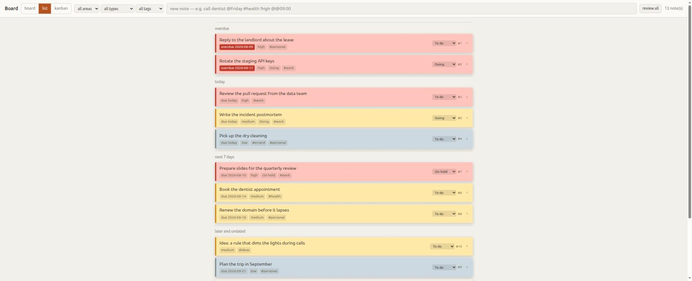

# Notes and the board

This is the half of the project that works everywhere. No Home Assistant, no
calendar, no API key, no GNOME — just Python and a file to write to.

## Capture

```bash
ta note "call the dentist @friday #health !high"
```

Or type into the field at the top of the board. Or bind a global shortcut to
`ta capture-popup` and never open a terminal — see [shortcuts.md](shortcuts.md).

Capture is **instant and offline, always**. The parser is a regex, it never
touches the network, and the response comes back before anything else happens
([ADR 0003](adr/0003-the-llm-is-never-on-the-critical-path.md)).

### The marks

| Mark | Means | Example |
|---|---|---|
| `#tag` | a theme | `#health` |
| `!priority` | how much it matters | `!high` `!medium` `!low` |
| `@date` | a deadline — makes it a **Task** | `@friday` `@2026-09-01` `@tomorrow` |
| `@@HH:MM` | a moment to be reminded — makes it a **Reminder** | `@@09:00` |

Text with no marks is a perfectly valid note. Most notes are.

`!alta`, `!media` and `!baixa` are accepted forever alongside the English words —
what you type is not what gets stored
([ADR 0006](adr/0006-one-note-entity-with-roles.md)).

> **`@@`, not `!!`.** The reminder mark used to be `!!HH:MM`, and it does not
> work in zsh: `!!` triggers history expansion as the line is read, and the
> command dies before reaching the parser. Measured in a real interactive shell,
> not assumed. `!!` still works from the board, which has no shell.

### Plain language

You do not have to use marks. These all work:

```bash
ta note "team sync tomorrow at 2pm"
ta note "dentist on October 17"
ta note "review the PR next friday"
```

The parser recognises **one language at a time** — whichever `ta lang` reports.
Numeric dates follow it: `@03/04` is 3 April in Portuguese and 4 March in
English. That is the entire reason only one is active
([ADR 0013](adr/0013-one-language-at-a-time.md)).

A token it does not recognise is not an error. `@home` is not a date, so it stays
in your text.

And it knows the difference between a plan and a diary entry: *"today I learned
about WAL mode"* does not get a deadline, because there is a curated list of
retrospective verbs guarding that. The regex gets the **form** right and would
get the **intention** wrong; when the AI is enabled, a second pass fixes what
slips through.

## Roles, not types

There is exactly one entity: a **Note**. It has no type field, and you never
choose one at capture time.

- A Note with a **deadline** is a **Task**. It is chaseable and can be completed.
- A Note with a **moment** is a **Reminder**. It is consumed when it fires.
- A Note can be both. Or neither.

Roles come from the presence of attributes, not from a choice
([ADR 0006](adr/0006-one-note-entity-with-roles.md)). This is why "turn this idea into a
task" is just adding a date, and never a conversion.

**Status** is a separate axis: `todo`, `doing`, `hold`, `done`, `cancelled`. A
Note can be a Task *and* be on hold. `done` and `cancelled` are both terminal —
they left the queue by different doors, and that difference is worth keeping.

## The order: deadlines first

**The clock orders the board, and priority orders within the band.**

Every task falls into a band counted from today:

| Band | When | Divider in the list |
|---|---|---|
| `overdue` | before today | **overdue** |
| `today` | today | **today** |
| `week` | the next 7 days — a rolling window, not the calendar week | **next 7 days** |
| `later` | beyond that, **and everything with no deadline** | **later and undated** |



So a `!low` due today sits above a `!high` due in three days. The one due today
is the one that has to be done today. In the picture above, "Pick up the dry
cleaning" is `!low` and sits above three `!medium` tasks — because it is due
today and they are not.

Two consequences worth knowing:

**A `!high` with no deadline sinks below every `!low` due this week.** That is
the price of putting undated notes in `later` rather than in a band of their own
— and it beats the alternative, where an important undated note would sink below
a `!low` due in September.

**The board turns the day over by itself.** The band is computed from the clock
at display time and never written to the database, so at midnight a note that was
due tomorrow becomes due today and moves up. Nothing is rewritten
([ADR 0010](adr/0010-the-clock-orders-the-board.md)).

## The board

```bash
ta board
```


It refreshes itself every 15 seconds — but **not** while you are dragging, and
**not** while there is text in the capture field, because a reload rebuilds the
DOM and would eat what you are typing.

### Three views

| View | For | What dragging does |
|---|---|---|
| **board** | free-form. A note stays where your hand left it | changes its **position** |
| **list** | everything in order, with a divider per band | — (use the status selector) |
| **kanban** | five columns by status; ordered by urgency inside each | changes its **status** |

The chosen view survives a reload.


⚠️ **The default view shows the least of the ordering.** A note you have dragged
stays put — your hand beats everything, which is the point — so the order only
shows in the initial layout of notes you never touched. Use **list** to see it.

### Colour

A note's colour comes from its priority unless you pick one. Choosing a colour by
hand stores it and wins from then on; the `A` button gives it back to automatic.

Area tags (`#work`, `#personal`) shift the shade slightly within a priority. The
six pairs were checked in CIELAB, between ΔE 8 and 11, because deriving them by a
fixed weight looked elegant and turned out to be invisible in grey and garish in
amber. Measuring is what showed that — by eye, a 22% weight had been approved.

### Filters and the trash

Three selectors filter by area, type and tag. An active filter is outlined,
because "there are no notes" and "the filter is hiding everything" looked
identical and the second one is alarming.

Deleting is reversible. `×` on a card asks for a second click, then moves the
note to `/board#lixeira` — a hash-hidden screen, because it is a recovery tool
and not part of anyone's day. `ta restore <id>` does the same from the terminal.

**Deleted is not `cancelled`.** `cancelled` means "I decided not to do this" and
stays in the kanban; deleted means "I don't want to see this" and leaves every
read path — the list, the digest, reminders, the review queue.

Emptying the trash is the only irreversible action in the tool, and it is styled
like it.

## Commands

| Command | What it does |
|---|---|
| `ta note "<text>"` | Capture |
| `ta list` | Open notes, in board order |
| `ta list --all` | Including done and cancelled |
| `ta done <id>` | Complete. Repeating reopens |
| `ta rm <id>` | Delete (reversible) |
| `ta restore <id>` | Take it out of the trash |
| `ta board` | Open the board |
| `ta export` | Dump everything as Markdown |
| `ta today` | The day's digest — events plus chaseable tasks |

`ta export` is the escape hatch that justifies storing things in SQLite. Your
notes are yours, in a text format, whenever you want them.

## The day's digest

```bash
ta today
ta today --date 2026-08-15
```

Calendar events, chaseable tasks, and the weather if Home Assistant is around.
Deterministic and instant — no model involved. `ta prose` says the same day in
sentences and *does* use one; it is decoration, and the listing is the default.

## The second pass

When the AI is enabled, each capture gets reviewed in the background — after the
response, never before. It fixes intent the regex cannot see, adds structural
tags, and can propose a calendar event.

It never overwrites what **you** typed. There is a flag recording who decided
each field, so what you set by hand is locked and what the model set is
revisable. Details in [ai.md](ai.md), including how to turn it off.
